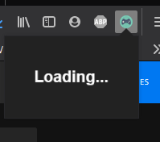

### Firefox Add-on for be notified about free games weekly claims on Epic Games Store.

This project is make for learning proposes only. 
Needed a backend for requests on Epic Games Store website.

* Go to `"about:debugging#/runtime/this-firefox"` on Firefox
* Load the file `"firefox/manifest.json"`
* Run the file `"backend/index.js"` with command `"npm start"`
#### Images

